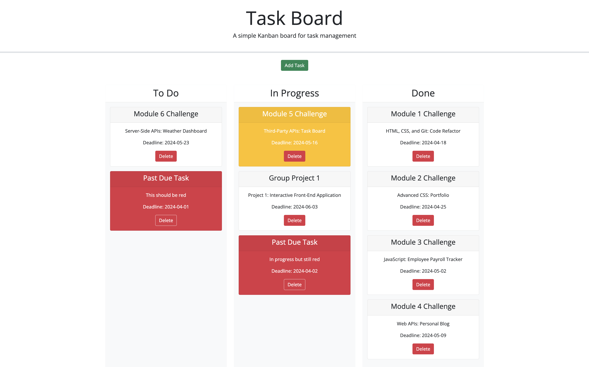

# Task Board Application

## Link to Deployed App

<https://rp192w.github.io/simple-kankan-board/>

## Overview

This repository contains the code for a simple Kanban-style task board application that allows project teams to manage their tasks. The application provides features for adding, updating, and deleting tasks, as well as dragging and dropping tasks between different progress states. Tasks are persisted using localStorage and are color-coded based on their due date using Day.js.

## File Structure

### HTML Files

- **index.html**: The main page that displays the task board with columns for different task states (To Do, In Progress, Done).

### CSS Files

- **style.css**: General styles for the task board application, including styles for task cards and columns.

### JavaScript Files

- **script.js**: Contains JavaScript code for handling task creation, updates, deletion, and drag-and-drop functionality. It also manages localStorage interactions and date handling using Day.js.

## Setup and Running

To run the application, go to the provided URL or clone the repo and open `index.html` in a web browser. Ensure your browser supports localStorage, which is required to persist tasks.

## Task Board (index.html)

This page includes:

- **Add Task Button**: Opens a modal dialog to add a new task with a title, description, and due date.
- **Task Columns**: Displays tasks in three columns based on their progress state:
  - **To Do**: Tasks that are not yet started.
  - **In Progress**: Tasks that are currently being worked on.
  - **Done**: Tasks that are completed.
- **Task Cards**: Each task is displayed as a card within the appropriate column, with color coding based on the task's due date:
  - Yellow for tasks nearing their due date (within 3 days).
  - Red for overdue tasks.

### Task Form Modal

- **Title**: Input field for the task title.
- **Task Due Date**: Input field for the task due date (with a date picker).
- **Description**: Text area for the task description.
- **Save Button**: Saves the task to localStorage and updates the task board.

## Known Issues

- **Drag and Drop**: Ensure you drag tasks carefully to avoid accidental drops.
- **LocalStorage**: Tasks will not persist if localStorage is disabled in your browser. Check your browser settings if tasks are not saving.

## Screenshots

